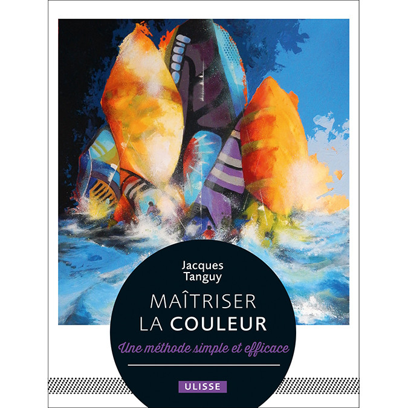

Based on the book "Maitriser la couleur" par Jacques Tanguy.

"L'approche novatrice des couleurs proposée dans ce livre repose sur l'analyse des valeurs du sujet à peindre. La valeur d'une couleur se définit par son niveau de gris une fois celle-ci traduite en noir et blanc. L'idée est de remplacer les couleurs du modèle par des couleurs ayant les mêmes valeurs. Cette démarche singulière de l'auteur permet de maîtriser facilement l’art des couleurs tout en encourageant la créativité."

